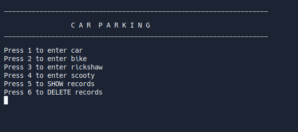
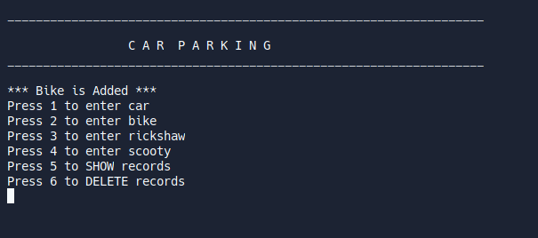
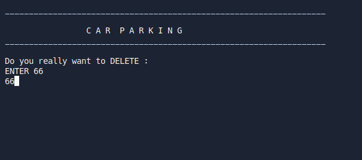
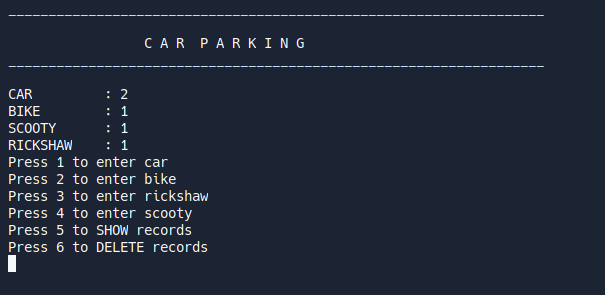

# Car Management System using C++
### A basic c++ program to get records of CAR Parking area.
## I have learnt :
1. functions
2. system calls like system("clear") or system("cls") etc.
3. Nested if - else

## [Demo](https://replit.com/@abdullah8674/Car-Management-System#main.cpp)
>Here are Some Images ::

